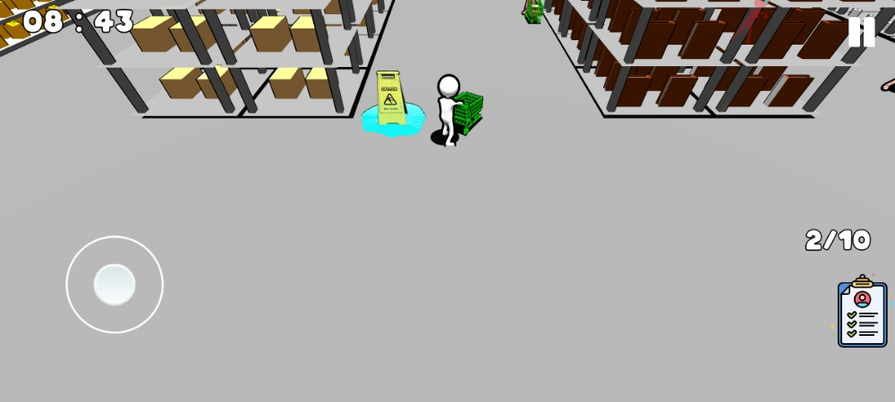
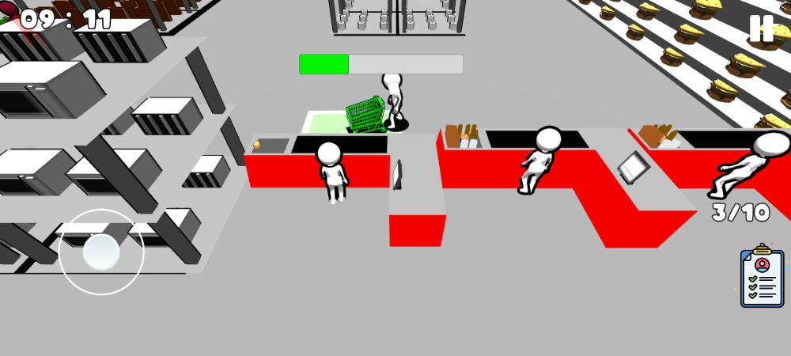
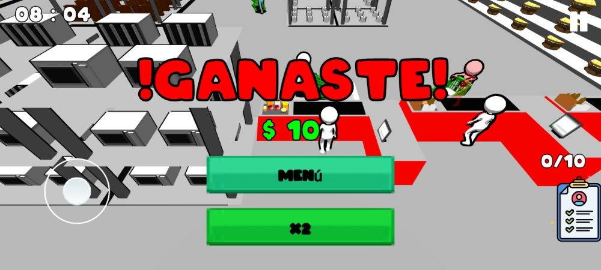
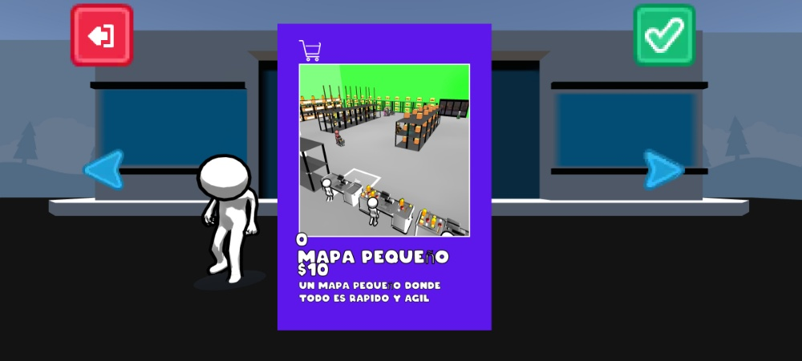
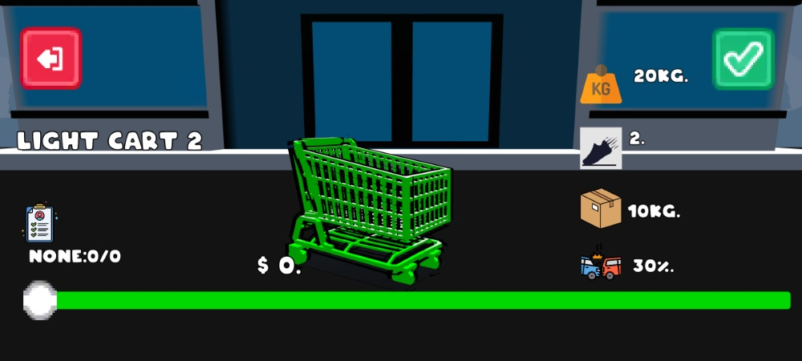

# 🛒 Supermarket Run

Un trepidante juego arcade de gestión y agilidad para Android desarrollado en **Unity**. El jugador toma el control de un carrito de supermercado con el objetivo de abastecer la caja registradora mientras esquiva obstáculos, maneja físicas de colisión dinámicas y defiende su mercancía de astutos carteristas.

> 📢 **Nota de Portafolio:** Este repositorio se mantiene público con fines de demostración de arquitectura de software, físicas en Unity y diseño de sistemas de juego. Actualmente, el proyecto se encuentra en la fase de **Prueba Cerrada (Closed Beta)** en Google Play Store previo a su lanzamiento oficial.

---

## 📸 Capturas de Pantalla (Gameplay & Menús)

### Bucle de Juego Principal

| Navegación por Pasillos | Descarga en Caja Registradora | Pantalla de Victoria |
| :---: | :---: | :---: |
|  |  |  |

### Sistemas de Metajuego (Menú y Tienda)

| Selección de Mapas | Personalización de Vehículo (Atributos) |
| :---: | :---: |
|  |  |

---

## 🕹️ Mecánicas de Juego Actuales

El núcleo del gameplay combina el control de inercias, la recolección de *items* y la gestión de riesgos en tiempo real:

* **Movimiento e Inercia:** Control del vehículo adaptado a dispositivos móviles. Si el jugador choca contra superficies u obstáculos, sufre un efecto de *knockback* (impulso hacia atrás).
* **Loop de Recolección:**
1. Recoger objetos recorriendo los estantes del supermercado.
2. Transportar la carga de forma segura en el carrito.
3. Depositar los objetos en la zona delimitada de la caja registradora para sumar puntos/dinero.
4. **Escalabilidad:** A mayor nivel de juego, aumenta proporcionalmente la cantidad de objetos requeridos en la lista de compras para ganar.

* **Sistema de Pérdida de Carga:**
* **Impactos fuertes:** Chocar a alta velocidad contra un NPC o estante provoca la caída física de un objeto al suelo. Este se puede recuperar del entorno regresando a su posición y presionando un botón de interacción.
* **El Ratero (Amenaza):** Si este NPC colisiona intencionalmente con el jugador, le roba **todas** las mercancías acumuladas en el carrito. El jugador cuenta con un tiempo límite para embestirlo de vuelta y recuperar su carga antes de que el ratero escape y desaparezca definitivamente de la partida.

---

## 🏪 Sistema de Metajuego (Menú y Tienda)

El juego cuenta con un bucle económico interno apoyado por mecánicas de progresión y monetización mediante anuncios:

### ⚡ Power-Ups Adquiribles

* **Manos Rápidas :** Optimiza la gestión de tiempo aumentando la velocidad de descarga en la caja registradora en un **50%**.
* **Protector :** Escudo pasivo que mitiga el impacto de un choque, previniendo la pérdida de objetos (un solo uso por partida).
* **Velocidad :** Incremento permanente del **20%** en la velocidad base de los desplazamientos.

### 🚙 Personalización y Progreso Técnico

* **Tipos de Chasis:** Selección de vehículos entre tres categorías de escala (**Chico, Mediano y Grande**), modificando el centro de masa y el comportamiento de las físicas.
* **Sistema de Skins con Atributos:** Cada aspecto visual cuenta con multiplicadores de estadísticas únicos (Capacidad de carga, Velocidad base, Resistencia a impactos, etc.).
* **Variedad de Escenarios:** Desbloqueo y compra de nuevos entornos con variaciones de tamaño de mapa (**Pequeño, Mediano y Grande**) para escalar el desafío estratégico.

---

## 🛠️ Especificaciones Técnicas & Arquitectura

* **Motor:** Unity
* **Lenguaje:** C#
* **Físicas del Vehículo:** Implementadas mediante el sistema físico integrado de Unity utilizando componentes `Rigidbody` y aplicación de fuerzas del motor (`AddForce` / `AddTorque`) para garantizar un comportamiento reactivo y un *knockback* realista en las colisiones.
* **Persistencia de Datos:** Gestión del estado del juego, monedas del usuario, mapas adquiridos y skins desbloqueadas implementada de forma local a través de `PlayerPrefs`.
* **Estructura de Monetización (Ads):**
* **Banner Ads:** Visibles de manera sutil durante la navegación de menús.
* **Rewarded Video Ads:** Anuncios bonificados opcionales para la adquisición de *Power-Ups* o para activar la bonificación de **Doble Recompensa (x2)** al finalizar una partida exitosa.
* **Interstitial Ads:** Anuncios a pantalla completa que se despliegan de manera estratégica al salir del flujo de gameplay principal, al reiniciar niveles, o de manera automatizada cada 3 partidas completadas en caso de que el jugador decida avanzar con la recompensa base (x1).

---

## 🚀 Próximas Mejoras & Roadmap

El proyecto se encuentra en desarrollo activo hacia su versión estable. El plan de ingeniería a futuro incluye:

* [ ] **1. Optimización de la IA del Ratero:** Implementar lógica aleatoria para controlar la densidad de amenazas (aparición de 0, 1 o 2 unidades simultáneas). Modificar su máquina de estados para que, tras un robo exitoso, tracen una ruta de huida inteligente hacia las salidas. Si hay dos activos, alternarán roles operacionales en tiempo real.
* [ ] **2. Sistema Dinámico de Flujo de NPCs:** Programar un gestor de entornos que controle las entradas y salidas lógicas por las puertas del supermercado, tanto para la simulación de clientes comunes como para la generación de rateros.
* [ ] **3. Feedback Visual Avanzado e Interfaz (UI):**
* **Carga Dinámica:** Renderizar de manera progresiva los modelos de los objetos dentro del carrito físico a medida que el inventario se llena.
* **Radar de Proximidad:** Diseñar un *slider* dinámico en pantalla que sirva de indicador de distancia relativa cuando un ratero escape con tu mercancía, optimizando la persecución.

* [ ] **4. Expansión de Contenido Cosmético:** Diseño de nuevas skins balanceadas mediante su respectivo scriptable object de atributos.
* [ ] **5. Level Design:** Estructuración y decorado de nuevos mapas vectoriales de gran escala.
* [ ] **6. Nueva Zona de Interacción:** Implementación del sector de Frutas y Verduras con dinámicas de recolección y físicas de empaquetado diferenciadas.

---

## ✒️ Créditos y Assets Terceros

Para el desarrollo visual de este prototipo se utilizaron recursos de la comunidad bajo sus respectivas licencias de uso:

* **Modelado del Jugador:** Modelo base extraído y adaptado desde [Sketchfab](https://www.google.com/search?q=https://sketchfab.com/).
* **Iconografía e Interfaz:** Paquetes de iconos e interfaz de usuario creados por [Kenney Assets](https://www.google.com/search?q=https://kenney.nl/) (recursos gratuitos con atribución).
* **Modelos de Entorno y Props:** Modelos propios del desarrollador y recursos *open-source* complementarios de uso libre.

---

## 📄 Licencia y Uso

Este proyecto se expone públicamente con fines de demostración técnica de portafolio. Todos los derechos sobre el código fuente y la integración final pertenecen al desarrollador del repositorio.

---
